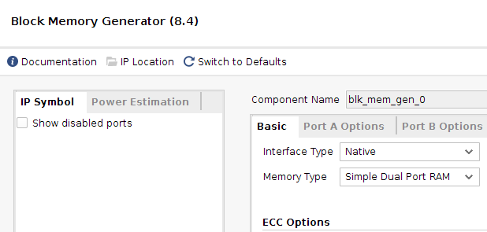
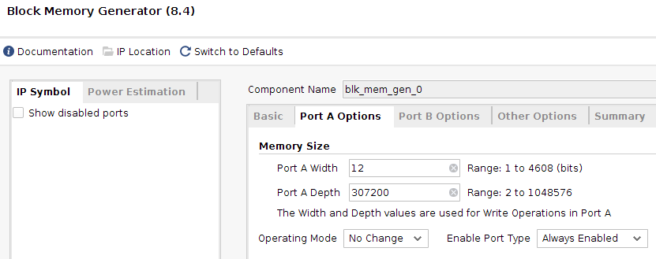
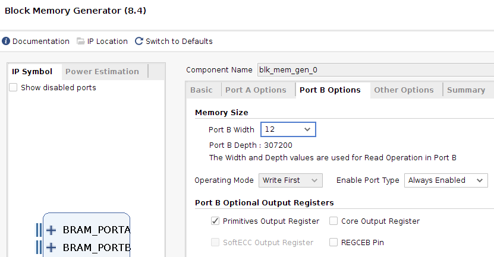

### Forked from @pcotret code. 

Adapted to run on **nexys4** board. memory block parameters are the same. 

# ov7670-zedboard

> Sources :
>
> - https://www.instructables.com/Connect-Camera-to-Zybo-Board/
> - https://github.com/Digilent/Zedboard/blob/master/Resources/XDC/zedboard_master.xdc

Sample project to make an OV7670 module working with the Zedboard. Create a Vivado project for the Zedboard and a BRAM with the following settings:

