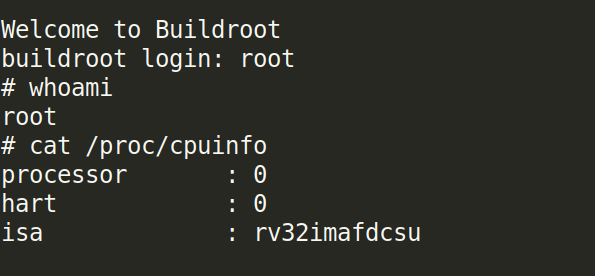
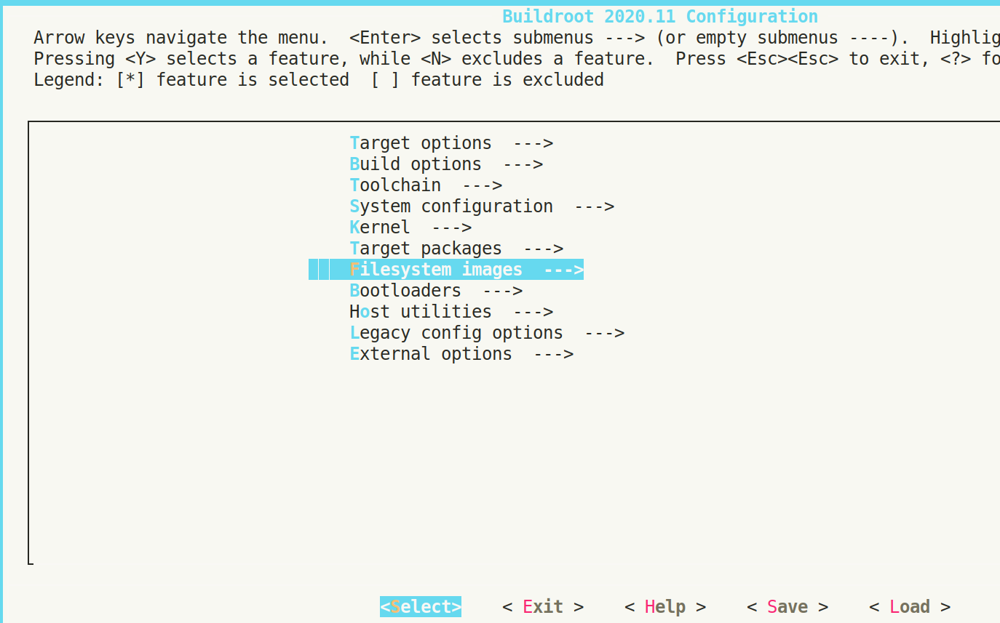

# ToDo list

- [x] Chargement d'un binaire cross-compilé
- [ ] Manipulation des périphériques existants
- [ ] Ajout d'un périphérique standard
- [ ] Ajout d'un périphérique custom
- [x] Recompil d'un noyau Linux Buildroot si on veut ajouter 2-3 utilitaires

## Architecture de base

Attention, dans l'architecture de base disponible ici https://github.com/litex-hub/linux-on-litex-vexriscv, le CPU a été compilé avec l'ISA `rv32ima`.

Quelques informations sur les options du compilateur sont disponibles [ici](./compiler-options.md).

## Utilisation d'un binaire cross-compilé

### Compilation

Soit le code C suivant :

```c
#include <stdio.h>
int main()
{
    printf("Hello EVEEX :p\n");
    return 0;
}
```

On le compile (ici avec la chaîne précompilée de SiFive) :

```bash
riscv64-unknown-elf-gcc -march=rv32ima -mabi=ilp32 -D__vexriscv__ -DUART_POLLING hello.c -o hello
```

- Les flags `march` et `mabi` servent à définir quel ISA on utilise pour le compilateur :
  - Attention si on prend un compilateur "random", on ne sera pas sûr de l'ISA utilisé...
  - Il vaut mieux fixer l'ISA dans la commande : comme ça, pas de surprise. D'ailleurs, on peut remarquer que j'ai compilé un binaire 32 bits avec un compilateur 64 bits :wink:

### Téléchargement et exécution du binaire sur FPGA

```bash
$ file hello
hello: ELF 32-bit LSB executable, UCB RISC-V, version 1 (SYSV), statically linked, with debug_info, not stripped
```

On se retrouve donc avec un binaire qu'on souhaite exécuter sur le processeur RISC-V implémenté sur FPGA. 

#### Ajout du binaire dans le *filesystem* Buildroot

Pour rappel, le Linux embarqué est à base de Buildroot qui permet de générer un Linux embarqué sur mesure.

Il se trouve que dans le Buildroot proposé par LiteX, on utilise la variable d'environnement `BR2_ROOTFS_OVERLAY` (https://github.com/litex-hub/linux-on-litex-vexriscv/blob/master/buildroot/configs/litex_vexriscv_defconfig#L35) qui, comme son nom l'indique, permet de customiser le système de fichier qui sera mis à disposition sur la carte. Il suffit donc de rajouter le binaire cross-compilé dans le répertoire pointé par `BR2_ROOTFS_OVERLAY` :

```bash
$ pwd
~/linux-on-litex-vexriscv/buildroot/board/litex_vexriscv/rootfs_overlay
$ ll
total 28K
drwxrwxr-x 2 pascal pascal 4,0K févr.  3 21:48 etc
-rwxrwxr-x 1 pascal pascal  23K févr.  3 15:14 hello
```

Ensuite, il faut regénérer l'image Buildroot (ce qui est très rapide car le process n'intègre que l'ajout du nouveau binaire) :

```bash
$ cd ~/buildroot
$ make
```

Et copier les images dans le répertoire de `llinux-on-litex-vexriscv` pour télécharger l'image sur la carte :

```bash
$ cp output/images/* ~/linux-on-litex-vexriscv/images
$ cd ~/linux-on-litex-vexriscv
$ sudo lxterm --images=images/boot.json /dev/ttyUSB1 --speed=1e6
```

Après le boot, on peut exécuter notre "Hello world" !

```
Welcome to Buildroot
buildroot login: root
                   __   _
                  / /  (_)__  __ ____ __
                 / /__/ / _ \/ // /\ \ /
                /____/_/_//_/\_,_//_\_\
                      / _ \/ _ \
   __   _ __      _  _\___/_//_/         ___  _
  / /  (_) /____ | |/_/__| | / /____ __ / _ \(_)__ _____  __
 / /__/ / __/ -_)>  </___/ |/ / -_) \ // , _/ (_-</ __/ |/ /
/____/_/\__/\__/_/|_|____|___/\__/_\_\/_/|_/_/___/\__/|___/
                  / __/  |/  / _ \
                 _\ \/ /|_/ / ___/
                /___/_/  /_/_/
  32-bit RISC-V Linux running on LiteX / VexRiscv-SMP.

login[67]: root login on 'console'
root@buildroot:~# cd /
root@buildroot:/# ./hello
Hello EVEEX :p
root@buildroot:/#
```

#### Pour plus d'informations

Le tutoriel de Christophe Blaess sur RaspberryPi est vraiment bien https://www.blaess.fr/christophe/buildroot-lab/index.html

Deux méthodes sont présentées pour intégrer du code métier :

- Ajout dans le "custom rootfs" (méthode utilisée ici)
- Ecriture de recette pour des projets métiers https://www.blaess.fr/christophe/buildroot-lab/index.html#VII.3

## Emulation d'un Buildroot avec QEmu

Voir ce tutoriel https://wiki.qemu.org/Documentation/Platforms/RISCV et les options pour un RISC-V 32 bits.



On a un Buildroot qui boot!

Le CPU est clairement plus générique que celui implémenté sur FPGA.

- Possible d'émuler un CPU IMA ?
- Possible d'utiliser la même image Buildroot que sur FPGA ?

## Manipulations des périphériques existants

TODO

## Recompilation d'un noyau Linux avec Buildroot

```bash
$ git clone http://github.com/buildroot/buildroot
$ cd buildroot
$ make BR2_EXTERNAL=../linux-on-litex-vexriscv/buildroot/ litex_vexriscv_defconfig
$ make menuconfig
```



On se retrouve avec un menu semblable à un bon vieux BIOS où on peut modifier plein de choses ! Quelques exemples :

- `System configuration => System hostname/banner` : assez explicite.
- `Target packages` : si on veut intégrer des paquets dans notre Linux embarqué.
- `Target options` : on peut voir que les options du fichier de configuration du VexRiscV sont bien prises en compte (architecture, ISA, ABI...)

Une fois les modifications effectuées, il suffit de sauvegarder et quitter : le delta sera intégré dans le fichier de configuration de Buildroot `.config` en plus des paramètres déjà pré-remplis.
