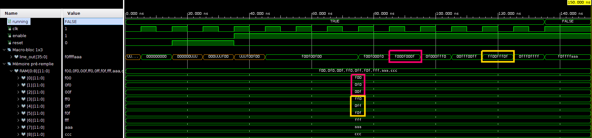

Extrait de code qui permet de lire une mémoire remplie en dur avec les valeurs des pixels (12 bits).

Et de stocker le résultat en un "macrobloc" de 1x3 pixels (36 pixels).

## Résultat de la simulation

Le macrobloc n'est disponible qu'après 3 cycles d'horloge (MxN cycles pour un macroblock de MxN pixels).